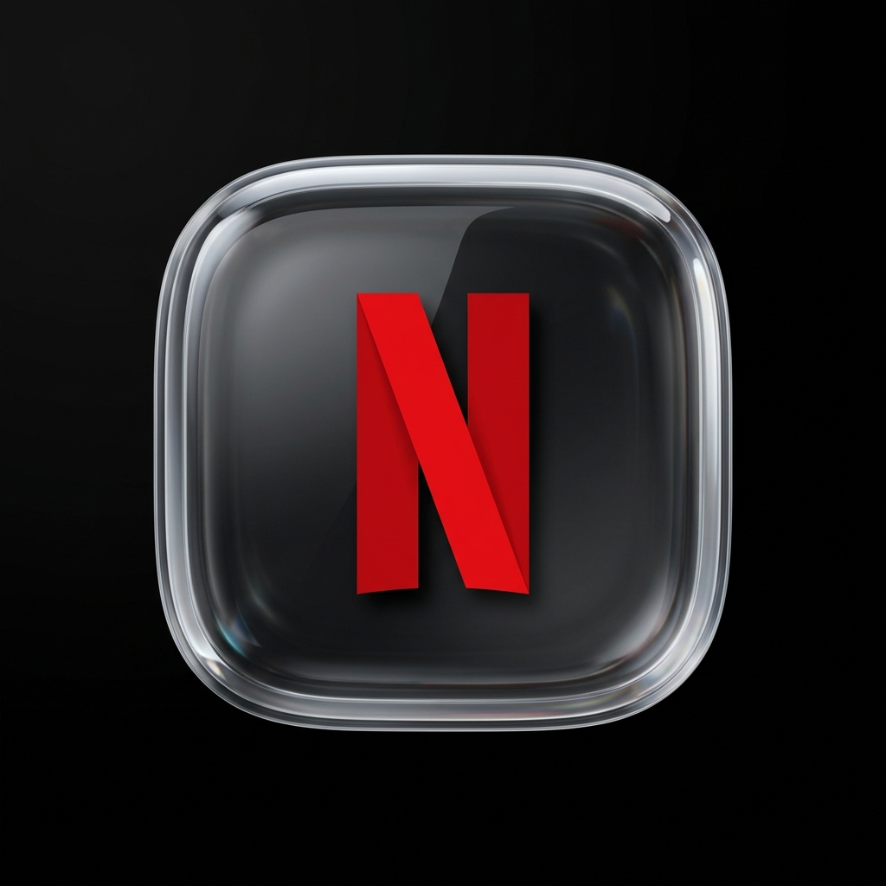

#  Netflix for macOS

A beautiful, native desktop app wrapper for **Netflix**. Built to run Netflix in a clean, borderless standalone window outside of your web browser, featuring native system integration.

---

## 📸 Screenshots

### The App Interface
The interface runs completely edge-to-edge, with a clean visual overlay that handles system integration.

---

## ✨ Features

*   📺 **Borderless Player:** Watch your favorite shows in a gorgeous, edge-to-edge window that fits natively on your Mac's screen.
*   🔮 **Liquid Glass Controls:** A floating navigation bar (Back, Forward, Reload, Home, OLED toggle, Settings) that appears when you move your mouse, and slides away when you're watching content.
*   🌑 **Pure OLED Black Mode:** Turn Netflix's standard dark gray background to pure pitch-black (`#000000`) to save battery and enhance contrast on MacBook Pro XDR/OLED displays.
*   ⏭️ **Auto-Skip Intro & Recaps:** Automatically skips intros, recaps, and starts the next episode instantly.
*   🎵 **System Media Keys Sync:** Use your keyboard's physical media keys (Play/Pause) and control active media directly from the macOS Control Center or lock screen.
*   🫵 **Trackpad Gestures:** Swipe left/right on your trackpad to go back or forward, just like in Safari.
*   ⚙️ **Native Preferences:** Change settings instantly by pressing **`Command + Comma (⌘,)`** or clicking the gear icon on the floating dock.
*   🔑 **Saved Sessions:** Securely remembers your login credentials so you never have to sign in repeatedly.

---

## 🚀 Easy Installation

1. Go to the **Releases** tab on the right side of this repository.
2. Download the latest **`Netflix.dmg`** installer.
3. Double-click the downloaded **`Netflix.dmg`** file to open it.
4. Drag the **Netflix** icon into your **Applications** folder shortcut.
5. Open **Netflix** from your Applications folder or Launchpad, sign in, and start watching!

---

## 📋 Requirements

*   Supports macOS 13 (Ventura), macOS 14 (Sonoma), and newer.
*   Compatible with both Intel and Apple Silicon (M-series) Macs.

